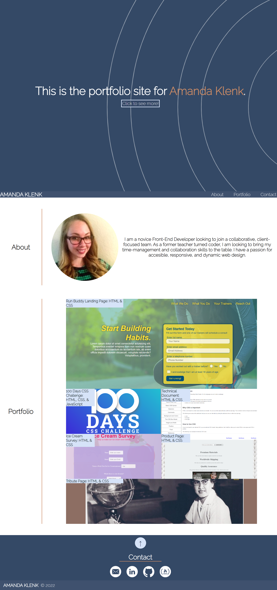

# Professional-Portfolio

## Description

The Professional Portfolio project was created as a demonstration of Amanda Klenk's experience and abilities to potential employers and collaborators. It contains a detailed about section with a recent photo, a portfolio section with links to each of her projects, and a contact section with links to each contact method.

The requirements for this project were as follows:
* The developer's name, photo, and links to about them, their work, and how to contact them are present.
* The UI scrolls to the corresponding sections when each nav link is clicked.
* The first project must have a larger displayed image than the subsequent projects.
* Each project image should have a link to the actual project that is deployed upon clicking.
* The page must be responsive at the major breakpoints.

## Table of Contents
- [Installation](#installation)
- [Links](#links)
- [Usage](#usage)
- [Creation](#creation)
- [Credits](#credits)
- [License](#license)
- [Project-Status](#project-status)

## Installation
The repository, Professional-Portfolio, was created and cloned from GitHub. An index.html file was created and was coded to contain the site content. A folder, assets, was created to house two folders, css and images. The images folder contains the site images (hero, bio picture, project images, and contact icons). The css folder contains the style sheet, style.css, which was coded to contain the site's styling details.

## Links
- [GitHub Repository](https://github.com/amklenk/Professional-Portfolio)
- [GitHub Pages Site](https://amklenk.github.io/Professional-Portfolio/)

## Usage

Below is a screenshot of the live site.

All of the links should work either to access each section within the site or each project outside of the site. The site should be responsive at all major breakpoints.

## Creation

Each of the requirements was fullfilled:
* The developer's name, photo, and links to about them, their work, and how to contact them are present.
* The UI scrolls to the corresponding sections when each nav link is clicked.
* The first project has a larger displayed image than the subsequent projects.
* Each project image has a link to the actual project that is deployed upon clicking in a new window.
* The page is responsive at the major breakpoints.

Once the respository was installed locally, the index.html file was filled out with the skeleton and then the additional content. The tags (head, body, section, header, nav, main, button, and footer) were chosen to be as responsive as possible. The hero and project images were moved to the CSS style sheet as background images. As a result, the project images each have title attributes with descriptions of each image instead of alt attributes.

The CSS style sheet, style.css, lists the variables and browswer styling first. The rest of the sheet is organized by the HTML sections and then - within each styling section - by element selectors, class selectors, and id selectors. The media queries are listed last. Any pseudoclasses are listed after their original element/class/id styling blocks. The positioning was reworked with flexbox and percentages as much as possible to make the design more responsive. There are multiple mobile media queries so that the site is responsive on as many mobile devices as possible.

## Credits
The following website was the inspiration behind the design of this porfolio site:
- [Matthew Williams' Developer Site](http://findmatthew.com)
The logos were downloaded, and then recolorized, from: 
- [Free Icons Site](https://icon-icons.com/)
The SVG was adapted from Andy Fitzsimon: 
[the deep blue](https://codepen.io/andyfitz/pen/aZrKdV)
## License

MIT License

Copyright (c) [2022] [Amanda Klenk]

Permission is hereby granted, free of charge, to any person obtaining a copy
of this software and associated documentation files (the "Software"), to deal
in the Software without restriction, including without limitation the rights
to use, copy, modify, merge, publish, distribute, sublicense, and/or sell
copies of the Software, and to permit persons to whom the Software is
furnished to do so, subject to the following conditions:

The above copyright notice and this permission notice shall be included in all
copies or substantial portions of the Software.

THE SOFTWARE IS PROVIDED "AS IS", WITHOUT WARRANTY OF ANY KIND, EXPRESS OR
IMPLIED, INCLUDING BUT NOT LIMITED TO THE WARRANTIES OF MERCHANTABILITY,
FITNESS FOR A PARTICULAR PURPOSE AND NONINFRINGEMENT. IN NO EVENT SHALL THE
AUTHORS OR COPYRIGHT HOLDERS BE LIABLE FOR ANY CLAIM, DAMAGES OR OTHER
LIABILITY, WHETHER IN AN ACTION OF CONTRACT, TORT OR OTHERWISE, ARISING FROM,
OUT OF OR IN CONNECTION WITH THE SOFTWARE OR THE USE OR OTHER DEALINGS IN THE
SOFTWARE.

## Project Status

This project is a work in progress. It will be updated via a develop and feature branches going forward. Feedback on positioning, design, functionality, and responsiveness is pivotal for future iterations of the live site. Each project tile will potentially have an animation instead of just an inner glow. The contact section will eventually have a user input section where the user can submit their name, email address, and message. The arrow button will be moved below the contact icons, but with different styling so that the user understands it is a nav button and not a contact icon. A media query will be added for extra large screens to enhance the design of the hero.